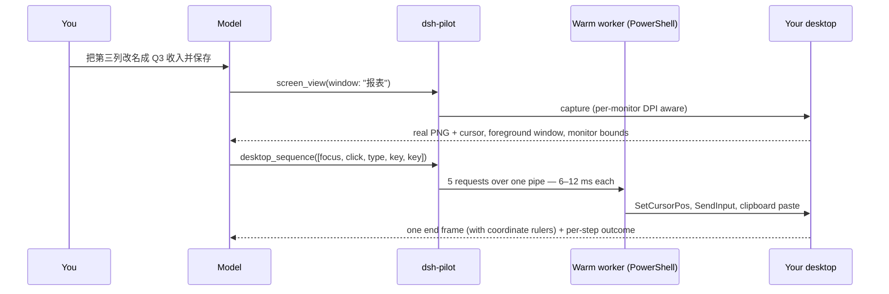
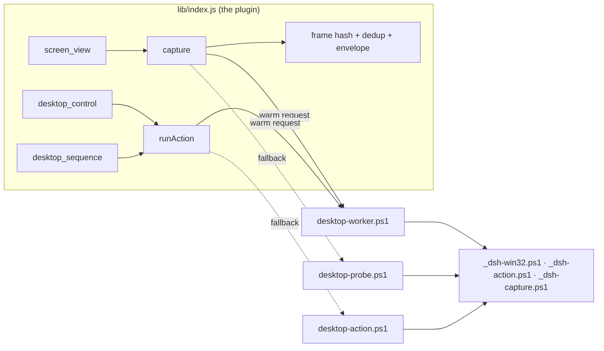

# dsh-pilot

**Give DeepSeek Harness hands and eyes.**

[](LICENSE)


[English](#why-this-exists) · [中文说明](#中文说明)

Out of the box, a DeepSeek Harness session can reason about your desktop but cannot
touch it: you describe what is on screen, you take the screenshots, you do the
clicking, and you report what happened. **dsh-pilot closes that loop.** The model
looks at the real pixels and then operates them:

| tool | what it does |
| --- | --- |
| **`screen_view`** | captures the live desktop and returns the PNG as a **real image block** the model can see — not OCR, not a text summary |
| **`desktop_control`** | moves the pointer, clicks, drags, scrolls, types, sends keys, focuses and lists windows — and can capture the result in the same call |
| **`desktop_sequence`** | runs a **whole batch** of those actions in one call and looks once at the end |

```text
You : 把浏览器里那个报表的第三列改名成 "Q3 收入"，然后保存
DSH : desktop_sequence([focus "报表.xlsx", click 812,430, type "Q3 收入", key enter, key ctrl+s])
      → 1 round trip, 1 screenshot, per-step timings, done
```

## Why this exists

A model that cannot see the screen has to be told what is on it. A model that cannot
touch the screen has to be told what to do next. That turns every desktop task into a
conversation about the desktop instead of work on the desktop — and the user becomes
the hands, the eyes, and the error message.

The expensive part of desktop automation was never the mouse. It is **how many times
the model and the computer have to talk**:

| a five-step task: focus a window, click a field, type, press Enter, look at the result | DSH alone | DSH + dsh-pilot |
| --- | --- | --- |
| who reads the screen | you | the model, from real pixels |
| who clicks and types | you | the model |
| model ↔ computer round trips | 5 (one per step, plus yours) | **1** |
| screenshots shipped to the model | 4–5 | **1** |
| where the model spends its time | waiting, re-describing, re-asking | thinking about the task |
| when a step fails | you notice | the same result says which step, and why |

## What it feels like



## Why the coordinates can be trusted

The classic way a vision-driven click goes wrong is a coordinate that is *almost*
right. dsh-pilot removes the three ways that happens:

**1. Both halves are per-monitor DPI aware.** A DPI-unaware process is lied to by
Windows: it sees a 2560×1600 panel as 1707×1067, so every click computed from such a
screenshot lands in the wrong place. The sensor and the effector each declare
`SetProcessDpiAwarenessContext(PER_MONITOR_AWARE_V2)` before doing anything, so one
image pixel is one physical screen pixel.

**2. Frames carry rulers.** Ticks every 200 px along the top and left edge, each
labelled with the **screen coordinate** it sits at, plus an `origin x,y step n` note.
The model reads a position off the image instead of counting pixels — and because the
labels are screen coordinates, they survive any downscaling the attachment store does.

**3. The envelope says what it actually delivered.** If the store re-encodes a frame
smaller, the model is told the ratio and the multiplier, and the coordinate contract
becomes conditional — it only promises "use x and y as they are" when the delivered
frame *is* the capture:

```text
<image_size delivered="1974x873" captured="2261x1000">1974x873</image_size>
<delivered_scale>delivered 1974x873 = 0.873x capture; multiply image readings by 1.1454 to get screen pixels</delivered_scale>
```

## Why it is fast

Batching is the big win (round trips, not clicks). The second win is that PowerShell
stops being restarted: one warm worker process answers every action and every frame.

| request | one-shot script | warm worker |
| --- | --- | --- |
| action (`move`, `click`, `type`, …) | ~0.9–2.0 s | **6–12 ms** |
| capture (primary monitor) | ~1.2–2.3 s | **~0.5 s** |

Measured on a 2560×1600 panel at 150% scaling with the harness UI animating. The
worker is started in the background on the first tool call, so the ~1 s it needs
overlaps the first capture instead of delaying the first action.

**Identical frames are not resent.** Every capture returns a `frameHash`; when a frame
is byte-identical to the previous one of the same session, the image is not attached
(or stored) again — the result says `unchanged: true` and the coordinates from the
frame the model already has still apply. `forceImage: true` overrides it.

## Why it is safe

Giving a model hands is the part worth getting right:

- **Risk is declared, then enforced.** Low risk (default) batches freely. A batch
  declared `medium`/`high`, or one carrying a step marked `risk: "high"`, is refused
  *before anything touches the desktop* unless the caller passes `confirm: true` —
  which it does only after you agreed.
- **`dryRun: true`** validates a batch and lists the plan without executing.
- **Stop on the first failure** (default): a refused `focus` can never be followed by
  typing into whatever window happens to be in front.
- **Targeted input.** When a step names a window (`hwnd`), the effector re-asserts it
  as foreground immediately before injecting, so a click cannot land in a neighbour.
- **An unknown outcome is never a silent retry.** If the worker dies after a request
  was delivered, the action is reported as failed rather than repeated — it may
  already have taken effect. A capture has no side effects, so it *is* retried.
- **Interruption works.** Pressing Esc writes a cancel token, the action loop polls it
  between every step (during drags, during the settle wait, before the capture) and a
  drag releases the button in a `finally` block, so an aborted turn cannot leave the
  mouse latched down or the remaining clicks playing out.
- **It cannot lie about privilege.** Windows refuses input injection into a
  higher-integrity (elevated) window; the tool reports that failure instead of
  pretending it worked.
- **`desktop_sequence` is bounded** by `maxSequenceSteps` (default 24).

## Install

```powershell
dsh plugin --profile <name> add "file:E:\path\to\dsh-pilot"
```

The package ships its own loader row, so `plugin add` places `dsh-pilot` in
`dsh.profile.bundles` and the row comes from the package (`dsh.bundle.patch` →
`cordis.patch.yml`) rather than being hand-written into your patch layer. **Restart
the desktop app** once afterwards, then start a new conversation: the three tools
join the tool list.

Requirements: **Windows**, PowerShell 5.1 or 7, and a model route that declares
image input (`deepseek-flash` does).

## Tools

### `screen_view`

| parameter | type | meaning |
| --- | --- | --- |
| `screen` | string | `primary` (default), `all` (whole virtual desktop), or a 0-based monitor index |
| `window` | string | case-insensitive substring of a window title or process name; frames that window |
| `region` | string | crop as `x,y,width,height` in physical screen pixels |
| `includeCursor` | boolean | draw a crosshair at the pointer (default `true`) |
| `rulers` | boolean | draw the coordinate rulers (default: the `rulers` setting) |
| `forceImage` | boolean | attach the frame even when it repeats the previous frame of the session |

The result carries the image plus a `<screen_capture>` envelope: delivered size,
capture size when they differ, physical origin, scale, every monitor's bounds, cursor
position, and the foreground window (title, process, class, bounds) — then the
coordinate contract for that frame.

### `desktop_control`

| parameter | type | meaning |
| --- | --- | --- |
| `action` | string, required | `click`, `doubleClick`, `rightClick`, `middleClick`, `move`, `drag`, `scroll`, `type`, `key`, `focus`, `windows` |
| `x`, `y` | integer | target in physical screen pixels; required by the pointer actions and by scroll-at-a-point |
| `toX`, `toY` | integer | drag end point, or a nonzero value to make `scroll` horizontal |
| `text` | string | text to insert for `type` |
| `key` | string | a character, `enter`/`tab`/`esc`/`f5`, or a chord like `ctrl+s`, `alt+tab`, `win` |
| `amount` | integer | wheel notches for `scroll` (default 3, positive scrolls up) |
| `button` | string | `left` (default), `right`, `middle` |
| `title` | string | window title or process substring; required by `focus`, filters `windows` |
| `hwnd` | string | lock input to one window handle (`0x1094C` or decimal) |
| `capture` | boolean | capture a fresh frame after acting (default `true`) |
| `settleMs` | integer | wait before that capture so the screen can repaint (default 750) |
| `forceImage` | boolean | attach the frame even when it repeats the previous frame of the session |

`type` delivers text as **one paste** (clipboard set, `Ctrl+V`, clipboard restored), so
applications see a single insertion — multi-line text and CJK included — instead of a
burst of per-character keystrokes. `windows` returns every visible titled top-level
window with its bounds, minimized state, and which is foreground: useful before
clicking anything.

### `desktop_sequence`

| parameter | type | meaning |
| --- | --- | --- |
| `steps` | array, required | ordered steps; each is one `desktop_control` action **without** its own screenshot, plus optional `settleMs`, `risk`, `riskNote`; action `wait` takes `ms` |
| `risk` | string | `low` (default) / `medium` / `high` — the risk you declare for the whole batch |
| `confirm` | boolean | required for a medium/high batch; without it the tool refuses before touching the desktop |
| `dryRun` | boolean | validate the batch and list the plan without executing anything |
| `capture` | string | `end` (default) captures one frame after the last step, `none` skips it |
| `target` | string | `window` (default: the window that was foreground during the batch), `screen`, or `all` |
| `window` | string | frame this window instead (title/process substring), overriding `target` |
| `region` | string | crop the end frame as `x,y,width,height` in physical pixels |
| `forceImage` | boolean | attach the end frame even when it repeats the previous frame |
| `stopOnError` | boolean | stop at the first failing step (default `true`) |
| `settleMs` | integer | delay before the end capture so the screen can repaint |

Every step comes back with its own action, duration in milliseconds, and outcome — so
one call still tells the model exactly where a batch went wrong.

## Settings

```yaml
- insert:
    - id: pilot
      name: dsh-pilot
      config:
        captureRetention: 30   # frames kept under .dsh-pilot/
        timeoutMs: 20000       # per-call kill deadline for a helper
        settleMs: 750          # default delay before the automatic capture
        stepSettleMs: 120      # per-step delay inside a desktop_sequence
        maxSequenceSteps: 24   # hard cap on the steps of one batch
        alwaysSaveFile: true   # keep the PNG even when no image block is attached
        useWorker: true        # keep one PowerShell process warm (6-12 ms actions)
        rulers: true           # draw coordinate rulers on every frame
```

## How it works



Two halves, one coordinate space: the sensor reports the geometry, the effector
consumes the same physical pixels, and `GetCursorPos`/`SetCursorPos` report back, so
the loop is self-checking.

The shared code sits in `_dsh-win32.ps1` (the Win32 bridge and DPI awareness,
idempotent), `_dsh-action.ps1` (`Invoke-DshAction`) and `_dsh-capture.ps1`
(`Invoke-DshCapture`). The one-shot scripts stay as thin bootstraps — they are what
the plugin falls back to when the worker cannot be used. The worker speaks one
base64 JSON request per line, answers with one JSON line per request, and keeps
serving after a failed action, a failed capture, or a cancelled step.

Captured frames land in `<session cwd>/.dsh-pilot/` and are pruned to
`captureRetention`. Pruning never breaks an image the conversation already carries,
because attachments are stored content-addressed.

## Troubleshooting

| symptom | cause and fix |
| --- | --- |
| `no visible top-level window matches "..."` | the window is hidden to the tray or the title changed; `desktop_control { action: "windows" }` lists what is really there, and `hwnd` targets a window that has no title match |
| clicks land next to the target | the frame was delivered smaller than the capture — check `<delivered_scale>` and apply the multiplier |
| a click does nothing | the target window may be elevated; Windows refuses input injection across integrity levels |
| the tools are missing after an update | restart the desktop app: a package's code is re-imported on load, and the profile's plugin rows are composed at boot |
| a batch refuses to run | it was declared `medium`/`high` (or contains a `risk: "high"` step): re-send with `confirm: true` after the user agreed, or `dryRun: true` to see the plan |

## Developing

The smoke tests load the plugin against the real `@deepseek-ai/dsh-tools` from the
desktop checkout, so they exercise every schema and renderer without a harness restart:

```powershell
# the package resolves @deepseek-ai/* from the desktop app's node_modules
New-Item -ItemType Junction -Path node_modules\@deepseek-ai `
  -Target "D:\AGAENT\DSH Desktop\resources\app\node_modules\@deepseek-ai"

node tools/smoke.mjs          "D:\AGAENT\DSH Desktop\resources\app"  # load, schemas, renderers
node tools/render-smoke.mjs   "D:\AGAENT\DSH Desktop\resources\app"  # coordinates: 1:1 vs shrunk, contract, rulers
node tools/sequence-smoke.mjs "D:\AGAENT\DSH Desktop\resources\app"  # end-to-end batch on a throwaway window
powershell -NoProfile -ExecutionPolicy Bypass -File tools\script-smoke.ps1  # PowerShell half + worker protocol
```

`sequence-smoke.mjs` drives a real batch against a throwaway window it creates
itself (never one of your applications) and the window writes back what it received —
so "focus, then type, then Enter" is proven to have happened **in that order**, not
merely attempted. `script-smoke.ps1` drives the PowerShell half directly: the one-shot
paths, the worker handshake, warm latency, a failing action, a cancellation, a failing
capture, and that the worker survives each of them. The last two need a full-access
shell: the plugin reads its helpers through pipes, which a restricted sandbox denies
with `EPERM`.

The helper scripts can be driven by hand while debugging — they take a UTF-8 JSON
params file and print one JSON result:

```powershell
'{"out":"E:\tmp\shot.png","screen":"primary","rulers":true}' | Set-Content params.json -Encoding utf8
powershell -NoProfile -File lib\scripts\desktop-probe.ps1  -ParamsPath params.json
powershell -NoProfile -File lib\scripts\desktop-action.ps1 -ParamsPath params.json
```

Keep the `.ps1` files saved **with a UTF-8 BOM**: Windows PowerShell reads BOM-less
files as ANSI, which mangles non-ASCII window titles and paths.

### Reinstalling after an edit

`dsh plugin add file:...` installs a **copy**, and a repeat `add` of an unchanged
`file:` spec reports "Already up to date" without re-copying even when the files on
disk changed. After editing, copy the changed files into the installed package
yourself and restart the desktop app:

```powershell
$src = "E:\path\to\dsh-pilot"
$dst = "$env:USERPROFILE\.dsh\profiles\<profile>\node_modules\dsh-pilot"
Copy-Item "$src\lib\index.js" "$dst\lib\index.js" -Force
```

### Why the smoke test validates result shapes

A tool result carrying a key its closed output schema does not declare is rejected by
the runtime **after** `execute()` has already performed the side effect — so the action
happens yet the caller sees an error. A schema-only check cannot see that failure
mode, so `smoke.mjs` validates a realistic result object against each tool's compiled
output schema, and additionally asserts that the validator itself catches the
undeclared `ok`/`actedAt` keys that shipped once.

## License

MIT © 2026 momasiku

---

# 中文说明

> **给 DeepSeek Harness 装上眼睛和手。**

DSH 原本只会"说"：它能推理、能写代码、能规划，但**看不见你的屏幕，也动不了你的鼠标**。于是看屏幕的是你、截图的是你、点按钮的是你、出错了汇报的也是你——你成了它的手、它的眼，还兼任它的报错信息。

**dsh-pilot 把这个环闭上**：模型直接看真实像素，然后自己动手。

| 工具 | 作用 |
| --- | --- |
| **`screen_view`** | 抓取当前屏幕，把 PNG 作为**真正的图像块**交给模型（不是 OCR、不是文字描述），连光标位置、前台窗口、各显示器范围一起给出 |
| **`desktop_control`** | 移动鼠标、单击/双击/右键、拖拽、滚轮、打字、按键、聚焦与列出窗口；可以在同一次调用里顺手截一张，让效果立刻可见 |
| **`desktop_sequence`** | **一次调用跑完一整串动作**，最后只看一眼结果 |

```text
你 ：把浏览器里那张报表的第三列改名成 "Q3 收入"，然后保存
DSH：desktop_sequence([focus "报表.xlsx", click 812,430, type "Q3 收入", key enter, key ctrl+s])
     → 1 次往返、1 张截图、每步耗时，完成
```

## 它到底解决了什么

桌面自动化的瓶颈**从来不是鼠标点得快不快**，而是 **"模型和电脑要来回说多少次话"**：

| 一个五步任务（聚焦窗口 → 点输入框 → 打字 → 回车 → 看结果） | 只用 DSH | DSH + dsh-pilot |
| --- | --- | --- |
| 谁在看屏幕 | 你 | 模型，看真实像素 |
| 谁在点击打字 | 你 | 模型 |
| 模型 ↔ 电脑往返次数 | 5 次（每步一次，外加你的） | **1 次** |
| 送给模型的截图 | 4–5 张 | **1 张** |
| 出错时 | 你发现、你描述 | 同一次结果里就写明哪一步、为什么 |

## 为什么坐标可信（这是"点得准"的关键）

视觉驱动点击最经典的翻车方式是"坐标差一点点"，这里堵掉了三个来源：

1. **两端都是 per-monitor DPI 感知**。非 DPI 感知的进程会被 Windows 骗——它把 2560×1600 的屏幕看成 1707×1067，于是按这种截图算出来的点击**必然偏**。传感器和执行器在做任何事之前都声明 `PER_MONITOR_AWARE_V2`，所以一个图像像素就是一个物理屏幕像素。
2. **每张图都带坐标刻度尺**：上沿与左沿每 200px 一条刻度，标注的是**屏幕坐标**（不是图像偏移），还有 `origin x,y step n` 说明。模型直接读刻度，不用数像素；刻度是屏幕坐标，所以即使图片被压缩也依然有效。
3. **信封如实说明交付尺寸**。如果宿主把图压小了，模型会收到比例与乘数；坐标契约也变成条件式——**只有在"交付尺寸 == 采集尺寸"时**才承诺"照用 x、y 即可"，否则明确要求乘多少：

```text
<delivered_scale>delivered 1974x873 = 0.873x capture; multiply image readings by 1.1454 to get screen pixels</delivered_scale>
```

## 为什么快

批处理是大头（省的是往返，不是点击）；第二个大头是**不再每次重启 PowerShell**——一个常驻 worker 同时服务动作与截图：

| 请求 | 一次性脚本 | 常驻 worker |
| --- | --- | --- |
| 动作（移动/点击/打字…） | ~0.9–2.0 秒 | **6–12 毫秒** |
| 截图（主屏） | ~1.2–2.3 秒 | **~0.5 秒** |

（2560×1600、150% 缩放、DSH 界面还在动的情况下实测）。worker 在第一次调用时后台预热，它需要的约 1 秒与第一张截图重叠，不会拖慢第一个动作。

**没变化的帧不重复发送**：每次截图都带 `frameHash`，与同会话上一帧逐字节相同时就不重复附图（也不重复存储），结果里写 `unchanged: true`，模型手上那张图的坐标继续有效；想看就传 `forceImage: true`。

## 为什么安全

给模型装上手，最该讲究的就是这一块：

- **风险先声明、后强制**：默认 `low` 可自由批量；声明 `medium`/`high` 的批次、或含 `risk: "high"` 步骤的批次，**在碰桌面之前**就被拒绝，除非调用方带 `confirm: true`（而它只会在你同意之后带）。
- **`dryRun: true`** 只校验并列出计划，不执行。
- **默认遇错即停**：`focus` 失败绝不会有"接着往面前那个窗口里打字"的后续。
- **定向输入**：步骤里指定了窗口（`hwnd`）时，注入前会再次把该窗口置前，点击不会落进旁边的窗口。
- **结果不明就绝不静默重试**：worker 在请求送达后死掉时，动作按失败上报而不是重放——它可能已经生效了；截图没有副作用，才会自动回退重试。
- **中断是真的能中断**：按 Esc 会写取消令牌，动作循环在每一步之间轮询（拖拽中、等待中、截图前都查），拖拽在 `finally` 里松开按键——中断的回合不会留下按住的鼠标，也不会把剩下的点击跑完。
- **不会假装成功**：Windows 禁止向更高完整性级别（提权）的窗口注入输入，工具会如实报错。
- **批量有上限**：`maxSequenceSteps`（默认 24）。

## 安装

```powershell
dsh plugin --profile <你的profile> add "file:E:\path\to\dsh-pilot"
```

包**自带 loader 行**：`plugin add` 会把 `dsh-pilot` 放进 `dsh.profile.bundles`，行本身来自包内的 `cordis.patch.yml`（由 `dsh.bundle.patch` 声明），所以不会像手写补丁行那样被插件管理器重写时弄丢。装完**重启一次 DSH Desktop**，然后**新开一个会话**，三个工具就会出现在工具列表里。

环境要求：**Windows**、PowerShell 5.1 或 7、以及声明了图像输入的模型线路（`deepseek-flash` 可以）。

## 使用要点

- 先 `desktop_control { action: "windows" }` 看清有哪些窗口、哪个在前台，再动手。
- 多步任务优先用 `desktop_sequence`：把"聚焦 → 点击 → 输入 → 回车"写成一次调用。
- 打字支持多行与中文（走剪贴板一次粘贴，之后恢复剪贴板）。
- 想更省 token：`capture: "none"` 不附图，或依赖"未变化不重发"；想看得更清：`rulers: true`（默认开）。
- 常用设置（`captureRetention`、`settleMs`、`stepSettleMs`、`maxSequenceSteps`、`useWorker`、`rulers`）写在配置行里，见上面的 Settings 一节。

## 常见问题

| 现象 | 原因与处理 |
| --- | --- |
| 提示找不到匹配窗口 | 窗口缩到托盘了，或标题变了：用 `action: "windows"` 列出来，或改用 `hwnd` 指定 |
| 点击总是差一点 | 图片被宿主压小了：看 `<delivered_scale>` 的乘数并乘上去 |
| 点了没反应 | 目标窗口可能是提权窗口，Windows 不允许跨完整性级别注入输入 |
| 升级后工具不见了 | 重启 DSH Desktop：包的代码在加载时重新导入，profile 的插件行在启动时合成 |
| 批次被拒绝执行 | 声明了 `medium`/`high`：经用户同意后带 `confirm: true` 重发，或先用 `dryRun: true` 看计划 |

## License

MIT © 2026 momasiku
